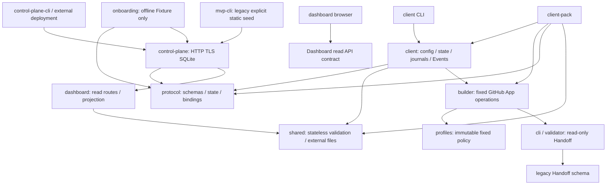

# Current modules and dependency boundaries

Main includes v0.2/v0.2.1-R1 and Client 0.4.4. GitHub stores development facts; CP stores runtime declarations with `authority_verified=false`. Code availability does not grant production authorization.

Network Client→CP is HTTP/SSE Protocol, not a source import of the CP Store/server. Before #47, Client local/client/deliver/publication directly imported `control-plane/security`; after #47, they import `shared/security` and `shared/external-files`. The CP security module re-exports the old symbols and the same Error class, preserving `instanceof`, public imports and failure semantics. The independent tarball includes shared modules and the compatibility security export, not CP Store/server/TLS/runtime config or browser code. Protocol remains independent of CP/Client/Builder.

## Entry and import/export/packaging inventory

This inventory follows imports/re-exports in `src`, package.json scripts and `scripts/client-pack.mjs`, rather than judging liveness from names. No source is deleted: no unreferenced file with proven absence of compatibility/audit value was identified.

| Module/files | Real callers / exports / packaging | Classification and responsibility |
| --- | --- | --- |
| `cli.ts`, `validator.ts` | `handoff:check`, Builder validation, legacy examples/tests; validator included in Client | Required + historical C0 compatibility; validate declarations only. |
| `protocol/{index,types,validation,events,client,handoff}.ts`, `schema.json` | CP/Client/Onboarding/MVP imports; index exports; included in Client | Required, pure schema/binding/Event/state rules and legacy Handoff mapping. |
| `control-plane/{index,security,store,server,tls,config}.ts`, `control-plane-cli.ts` | CP CLI, Dashboard read Store/routes, static seed, offline tests/fixture scripts; index exports security/store/server | Required server/SQLite ownership. New runtime config is deployment only; Store existing mode cannot initialize/migrate/seed. Legacy constructor kept for explicit embedded init/fixtures. |
| `shared/{security,external-files}.ts` | Client, CP security compatibility export, CP config/TLS/Store; included in Client pack | Shared pure JSON/ID/Error/limits and operator-file checks. No database, principal, App credential minting or network. |
| `client/{index,cli,local,http,version,client}.ts` | `client` script and independently installed `awh` bin; index exports; pack copies Client | Required local identity/config, explicit HTTP auth, namespace/session/Run/Event state and fixed commands. |
| `client/{deliver,delivery-policy,recovery,revision,publication}.ts` | CLI/Client orchestration; imports Builder/Profiles; all packed | Required delivery, immutable journal/receipts, explicit one-shot recovery and document revision overlay. |
| `builder.ts`, `profiles.ts`, `builder-cli.ts` | Client deliver/revision/recovery, Builder CLI; Builder/Profiles packed, CLI excluded | Required fixed App policy/identity/transport/provider observation. Legacy c05/c06/c07/default exports retained; no dynamic authorization. |
| `mvp-cli.ts` | `mvp` script, MVP/repeatable tests, approved historical static seed | Historical compatibility with explicit callers. Never a normal startup side effect. |
| `dashboard/{gateway,projection,routes,security,stream-cache}.ts` | CP read routes, opt-in sidecar API, Dashboard fixture/smoke/load tests; excluded from Client pack | Required optional read-only viewer projection/auth/SSE. Gateway default OFF; #30 remains **PHASE_C_ACCEPTED_WITH_EXCEPTION**. |
| `dashboard/` browser and `scripts/dashboard-{build,fixture,smoke,load}.mjs` | build, explicit pnpm scripts, browser contract/UI tests | Build/runtime viewer assets and test-only in-memory preview/load. No implicit production launcher. |
| `onboarding/{types,security,store,api,index,fixture,mock}.ts`, `schema.json` | index re-exports, offline fixture contract script and onboarding tests | Offline Fixture only. Keep fixture/mock and APIs; production Operator/Pairing unavailable. |
| `tests/fixtures/*`, old tests and `examples/*` | Test harnesses, docs, schemas; PR92 history/comments/publication fixtures referenced by revision/publication suites | Test-only + immutable historical audit/compatibility. No rewriting PR92 9 Run/52 Event or old outcomes. |
| `scripts/client-pack.mjs`, `npm-tool.mjs` | `client:pack` and standalone-install tests | Required offline distribution with dependency closure; no registry publish. |
| certificate/firewall provisioning scripts | Documented operator procedure, not automatic build/run | Compatibility tooling. Requires separate production authorization. |

## Remaining boundaries and debt

`client/client.ts` owns namespace locking, context/session validation, Event replay, delivery lifecycle and receipt/revision/recovery qualification. A future refactor can isolate pure session/receipt validation from orchestration, but must preserve exact bytes, hashes, sequence/ACK and one-shot semantics. This change only moves the already shared stateless checks; it does not mix a large rewrite with behavior changes.

`builder.ts` owns dependency injection, worktree/key qualification, JWT/live installation scopes, suppressed transport diagnostics, fixed write surfaces and lifecycle/publication readbacks. Future seams are pure response qualification and redaction, separate from authenticated transport/transaction decisions. Keep owner ID, repository/branch, selected-set, permissions and fixed mutation boundaries trusted; [config inventory](../config/README.md) classifies the literals. #34 dynamic authorization is deferred.

Onboarding `api.ts` catch→`store.recordDenied()` can persist unauthenticated requests repeatedly. The audit amplification fix belongs to [#31 Phase B0](https://github.com/zlpoot/agent-workflow-hub/issues/31#issuecomment-6057899954); it remains unresolved here. No production Onboarding route is wired into CP CLI/server. Fixture tests cannot establish production pairing PASS. Dashboard historical exception remains unchanged; no real gateway/CP/Operator is enabled by #47.

This Issue uses clean-head build and changed-path tests/scratch smoke. Full test-system overhaul, coverage/lint targets, full E2E, real dual-machine/production checks and architecture splitting remain separate work. No existing SQLite v2 history, Client credential/state/endpoint, receipt/overlay or other project's worktree is an implementation input.
